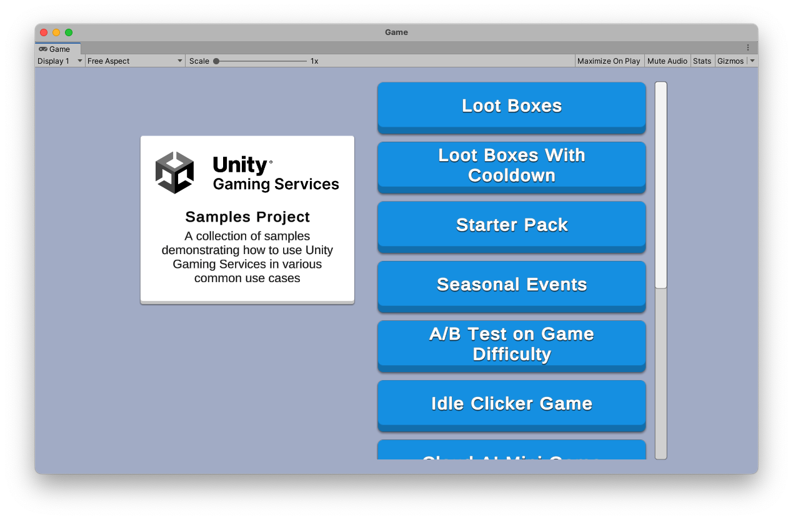
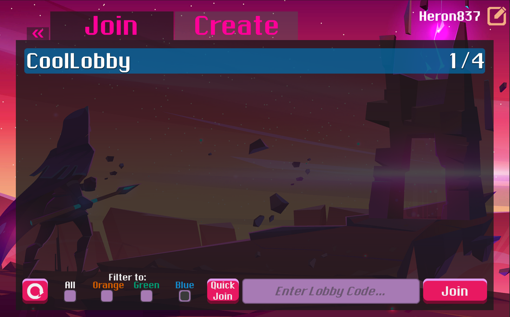

# Unity Gaming Services Samples

This repository serves as a hub for multiple sample Unity projects which demonstrate features of Unity Gaming Services SDKs.

> **Note**: The Unity Gaming Services are currently in Open Beta. To participate in the Unity Gaming Services Open Beta and use the new services, go to the
[Unity Dashboard](https://dashboard.unity3d.com/) &gt; Explore Services &gt; Unity Gaming Services Beta Details, and click Join now.

## Getting Started

You can clone this repository with all submodules using `git clone --recurse-submodules [url]`.
You can also clone each submodule individually.
This repository and all sample repositories are read only.

## Overview

### Game Operations Samples

This collection of samples is designed to guide developers to use multiple Unity Gaming Services in a single project.
These samples demonstrate how various services can be used together to:
* Address and implement typical backend game use cases and game design elements
* Resolve specific development tasks
* Show the efficiency you can achieve in your game backend by leveraging the Unity Gaming Services packages in your project

See the [Game Operations Samples repo](https://github.com/Unity-Technologies/com.unity.services.samples.game-operations)
to get started with exploring samples that implement various Unity Gaming Services,
such as Authentication, Economy, Remote Config, Cloud Code, and Cloud Save.

### Game Lobby Sample

This sample demonstrates how to use the Lobby and Relay packages to create a typical game lobby experience.
Players can host lobbies that other players can join using a public lobby list or lobby code,
and then connect with Relay to use Unity Transport ("UTP") for basic real-time communication between them.
Relay allows players to securely communicate with each other while maintaining connection anonymity.

See the [Game Lobby Samples repo](https://github.com/Unity-Technologies/com.unity.services.samples.game-lobby)
to get started with exploring samples that implement Unity Gaming Services, such as Relay and Lobby.
